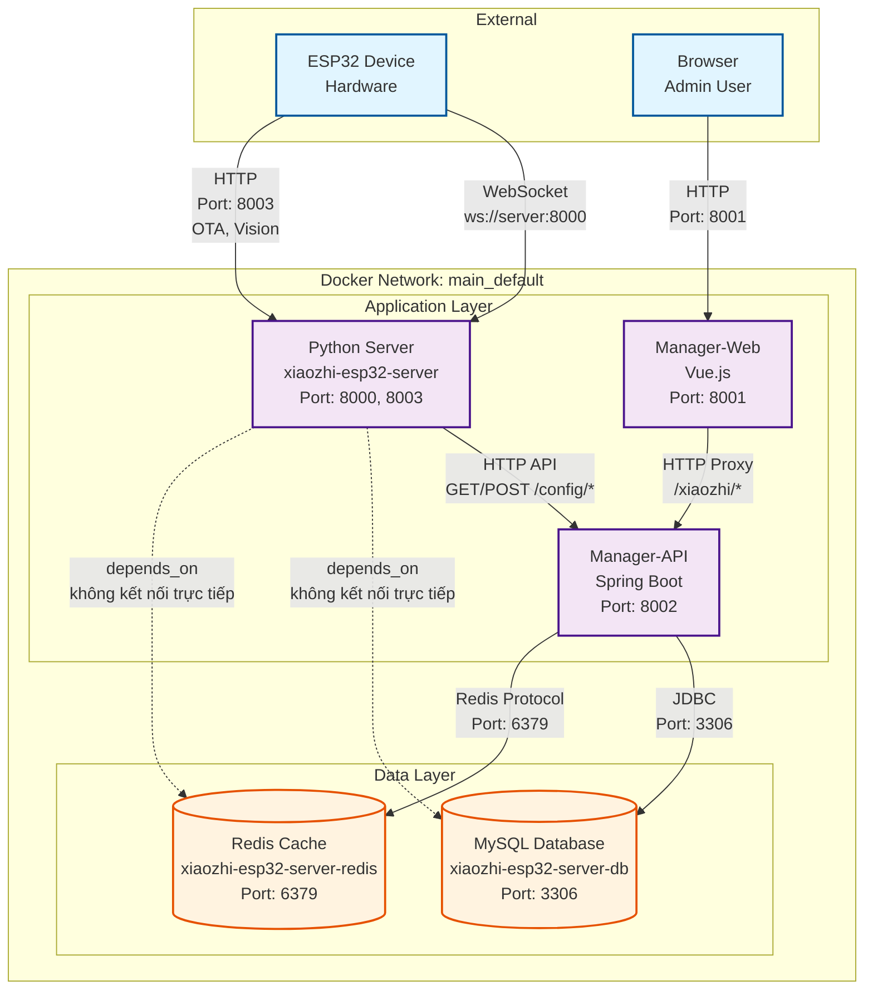

# Sơ đồ quan hệ hệ thống Xiaozhi ESP32

## 📊 Sơ đồ Mermaid (Interactive)



## 📊 Sơ đồ tổng quan (ASCII Art)

```
┌─────────────────────────────────────────────────────────────────────────┐
│                         HỆ THỐNG XIAOZHI ESP32                          │
└─────────────────────────────────────────────────────────────────────────┘

┌──────────────┐
│   ESP32      │  (Thiết bị phần cứng)
│   Device     │
└──────┬───────┘
       │
       │ WebSocket / HTTP
       │ Port: 8000 (WebSocket)
       │ Port: 8003 (HTTP - OTA, Vision API)
       │
       ▼
┌─────────────────────────────────────────────────────────────────────────┐
│                    Python Server (xiaozhi-server)                       │
│                    Container: xiaozhi-esp32-server                       │
│                    Port: 8000 (WebSocket), 8003 (HTTP)                  │
└─────────────────────────────────────────────────────────────────────────┘
       │
       │ HTTP API (httpx)
       │ GET/POST /config/server-base
       │ GET/POST /config/agent-models
       │ POST /agent/chat-history/report
       │
       ▼
┌─────────────────────────────────────────────────────────────────────────┐
│                    Manager-API (Spring Boot)                             │
│                    Container: xiaozhi-manager-api-dev                    │
│                    Port: 8002                                            │
└─────────────────────────────────────────────────────────────────────────┘
       │
       │                    │
       │                    │
       ▼                    ▼
┌──────────────┐    ┌──────────────┐
│    MySQL     │    │    Redis     │
│   Database   │    │    Cache     │
│              │    │              │
│ Port: 3366   │    │ Port: 6379   │
│ (external)   │    │ (internal)   │
│              │    │              │
│ Container:   │    │ Container:   │
│ xiaozhi-     │    │ xiaozhi-     │
│ esp32-       │    │ esp32-       │
│ server-db    │    │ server-redis │
└──────────────┘    └──────────────┘
       ▲                    ▲
       │                    │
       │                    │
       └────────────────────┘
              │
              │ HTTP REST API
              │ Proxy: /xiaozhi/*
              │
              ▼
┌─────────────────────────────────────────────────────────────────────────┐
│                    Manager-Web (Vue.js Frontend)                        │
│                    Container: xiaozhi-esp32-manager-web-dev             │
│                    Port: 8001                                            │
└─────────────────────────────────────────────────────────────────────────┘
       ▲
       │
       │ HTTP (Browser)
       │
       ▼
┌──────────────┐
│   Browser    │  (Người dùng quản trị)
│   (Admin)    │
└──────────────┘
```

## 🔄 Luồng dữ liệu chi tiết

### 1. Luồng ESP32 → Python Server
```
ESP32 Device
    │
    │ WebSocket Connection
    │ ws://server:8000/xiaozhi/v1/
    │
    ▼
Python Server
    ├─ Nhận audio/voice từ ESP32 (WebSocket:8000)
    ├─ Xử lý ASR (Speech Recognition)
    ├─ Xử lý LLM (AI Response)
    ├─ Xử lý TTS (Text-to-Speech)
    ├─ Gửi audio response về ESP32
    └─ Cung cấp OTA interface (HTTP:8003)
        └─ /xiaozhi/ota/ - OTA endpoint
        └─ /xiaozhi/ota/download/{filename} - Download firmware
```

### 2. Luồng Python Server → Manager-API
```
Python Server (Khởi động)
    │
    │ Đọc config từ data/.config.yaml
    │ Kiểm tra: manager-api.url có tồn tại?
    │
    ├─ Có URL → Gọi HTTP API
    │   │
    │   │ POST http://manager-api:8002/xiaozhi/config/server-base
    │   │ Header: Authorization: Bearer {secret}
    │   │
    │   ▼
    │ Manager-API
    │   │
    │   │ Query từ MySQL
    │   │
    │   ▼
    │ MySQL Database
    │   │
    │   │ Trả về config
    │   │
    │   ▼
    │ Manager-API → Python Server (JSON response)
    │
    └─ Không có URL → Đọc từ file config.yaml local
```

### 3. Luồng Manager-Web → Manager-API
```
Browser (Admin)
    │
    │ HTTP Request
    │ http://localhost:8001
    │
    ▼
Manager-Web (Vue.js)
    │
    │ Proxy API calls
    │ VUE_APP_API_PROXY_TARGET=http://manager-api-dev:8002
    │ VUE_APP_API_BASE_URL=/xiaozhi
    │
    │ HTTP REST API
    │ GET/POST/PUT/DELETE /xiaozhi/*
    │
    ▼
Manager-API (Spring Boot)
    │
    ├─ Đọc/ghi MySQL
    │   │
    │   ▼
    │ MySQL Database
    │
    └─ Đọc/ghi Redis Cache
        │
        ▼
    Redis Cache
```

### 4. Luồng Manager-API → Database
```
Manager-API
    │
    ├─ JDBC Connection
    │   jdbc:mysql://xiaozhi-esp32-server-db:3306/xiaozhi_esp32_server
    │   │
    │   ▼
    │ MySQL Database
    │   ├─ Lưu config thiết bị
    │   ├─ Lưu chat history
    │   ├─ Lưu user accounts
    │   └─ Lưu device bindings
    │
    └─ Redis Client
        redis://xiaozhi-esp32-server-redis:6379
        │
        ▼
    Redis Cache
        ├─ Session cache
        ├─ Config cache
        └─ Token cache
```

## 🔌 Kết nối mạng (Docker Network)

```
┌─────────────────────────────────────────────────────────────┐
│              Docker Network: main_default                   │
│              Driver: bridge                                 │
└─────────────────────────────────────────────────────────────┘

┌──────────────────────┐
│ xiaozhi-esp32-server │  ← ESP32 kết nối qua port 8000 (external)
│ (Python Server)      │
│ Port: 8000, 8003     │
└──────────┬───────────┘
           │
           │ HTTP API
           │ http://xiaozhi-esp32-server-web:8002/xiaozhi
           │
           ▼
┌──────────────────────┐
│ xiaozhi-manager-api- │  ← Manager-Web kết nối qua port 8002 (external)
│ dev                   │
│ (Spring Boot)         │
│ Port: 8002            │
└──────────┬────────────┘
           │
           ├──────────────┬──────────────┐
           │              │              │
           ▼              ▼              ▼
┌──────────────┐  ┌──────────────┐  ┌──────────────┐
│ xiaozhi-esp32│  │ xiaozhi-esp32│  │ xiaozhi-esp32│
│ -server-db   │  │ -server-redis│  │ -manager-web│
│ (MySQL)      │  │ (Redis)      │  │ -dev (Vue)  │
│ Port: 3306   │  │ Port: 6379   │  │ Port: 8001  │
│ (internal)   │  │ (internal)   │  │ (external)  │
└──────────────┘  └──────────────┘  └──────────────┘
```

## 📋 Bảng tóm tắt kết nối

| Từ | Đến | Giao thức | Port | Mục đích |
|---|---|---|---|---|
| **ESP32** | Python Server | WebSocket | 8000 | Giao tiếp real-time (audio, voice) |
| **ESP32** | Python Server | WebSocket | 8000 | Giao tiếp real-time (audio, voice) |
| **ESP32** | Python Server | HTTP | 8003 | OTA updates, Vision API |
| **Python Server** | Manager-API | HTTP REST | 8002 | Lấy config, báo cáo chat history |
| **Manager-Web** | Manager-API | HTTP REST | 8002 | Quản lý config, devices, users |
| **Manager-API** | MySQL | JDBC | 3306 | Lưu trữ dữ liệu persistent |
| **Manager-API** | Redis | Redis Protocol | 6379 | Cache, session management |
| **Browser** | Manager-Web | HTTP | 8001 | Giao diện quản trị |
| **Browser** | Python Server | HTTP | 8003 | OTA interface, Test page, Vision API |

## 🔐 Xác thực

```
┌─────────────────────────────────────────────────────────────┐
│                    Xác thực (Authentication)                 │
└─────────────────────────────────────────────────────────────┘

1. Python Server → Manager-API
   Header: Authorization: Bearer {secret}
   Secret lấy từ: data/.config.yaml → manager-api.secret

2. Manager-Web → Manager-API
   JWT Token (qua login form)

3. ESP32 → Python Server
   WebSocket connection (có thể có auth_key nếu enabled)
```

## 📦 Dependencies (depends_on)

```
┌──────────────────────┐
│ Python Server        │
│ depends_on:          │
│  - MySQL (healthy)   │  ← Chỉ để đảm bảo DB sẵn sàng
│  - Redis (healthy)   │  ← Chỉ để đảm bảo Redis sẵn sàng
└──────────────────────┘
       │ (không kết nối trực tiếp)
       │
       ▼
┌──────────────────────┐
│ Manager-API          │
│ depends_on:          │
│  - MySQL (healthy)   │  ← Kết nối trực tiếp qua JDBC
│  - Redis (healthy)   │  ← Kết nối trực tiếp qua Redis client
└──────────────────────┘

┌──────────────────────┐
│ Manager-Web          │
│ depends_on:          │
│  - Manager-API       │  ← Kết nối qua HTTP proxy
└──────────────────────┘
```

## 🎯 Tóm tắt

1. **ESP32** kết nối trực tiếp với **Python Server** qua WebSocket (port 8000) và HTTP (port 8003 cho OTA)
2. **Python Server** lấy config từ **Manager-API** qua HTTP REST API (port 8002) - không kết nối trực tiếp MySQL
3. **Manager-API** (port 8002) kết nối trực tiếp với **MySQL** và **Redis**
4. **Manager-Web** (port 8001) kết nối với **Manager-API** qua HTTP proxy
5. **OTA** chạy trên **Python Server** port **8003**, không phải Manager-API port 8002
6. **Python Server** phụ thuộc vào MySQL/Redis (depends_on) nhưng không kết nối trực tiếp, chỉ để đảm bảo services sẵn sàng

## ⚠️ Lưu ý về Ports

- **Port 8000**: Python Server WebSocket (ESP32 ↔ Python Server)
- **Port 8001**: Manager-Web Frontend (Browser ↔ Vue.js)
- **Port 8002**: Manager-API Backend (Python Server ↔ Spring Boot, Manager-Web ↔ Spring Boot)
- **Port 8003**: Python Server HTTP (OTA, Vision API) - **KHÔNG PHẢI** port 8002
